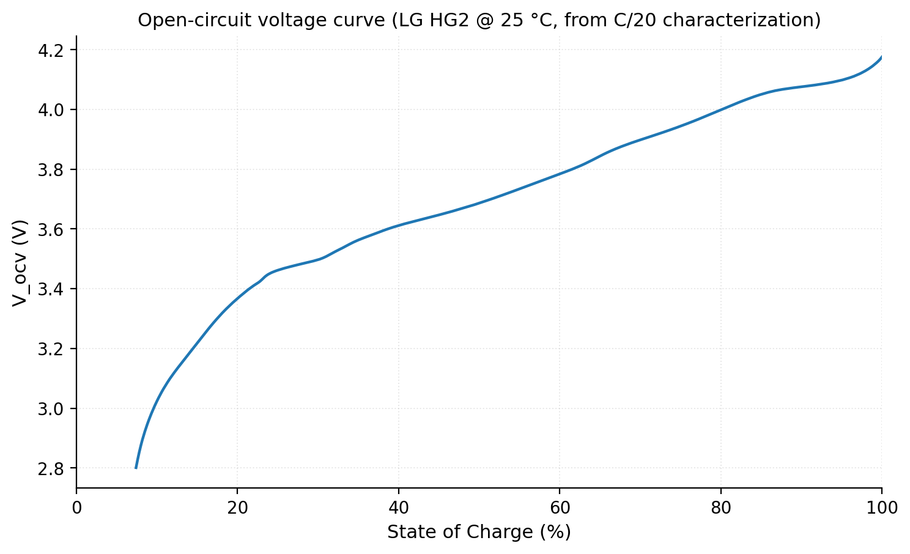
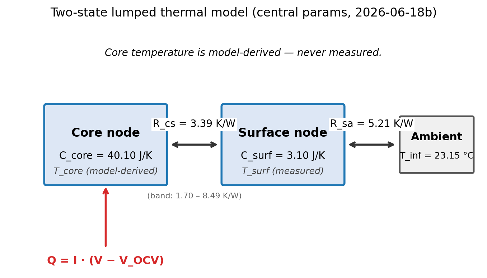
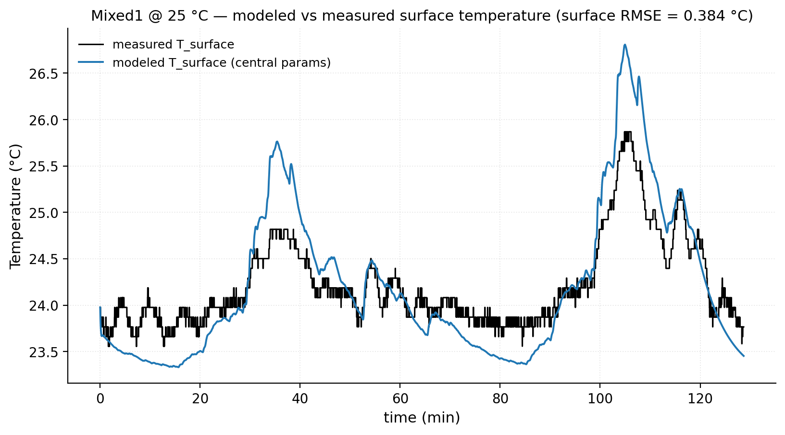
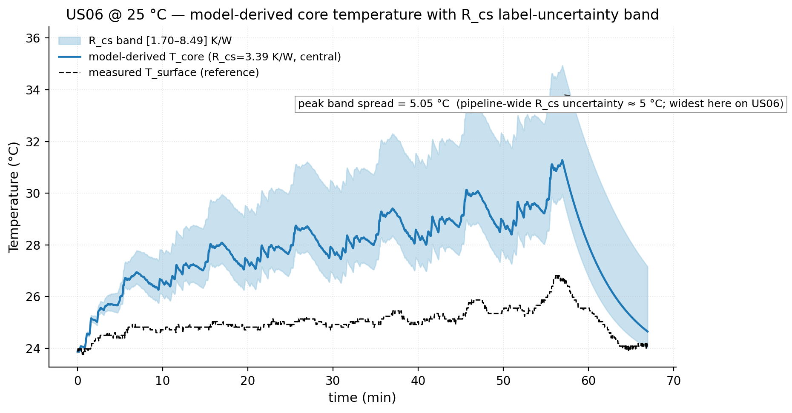
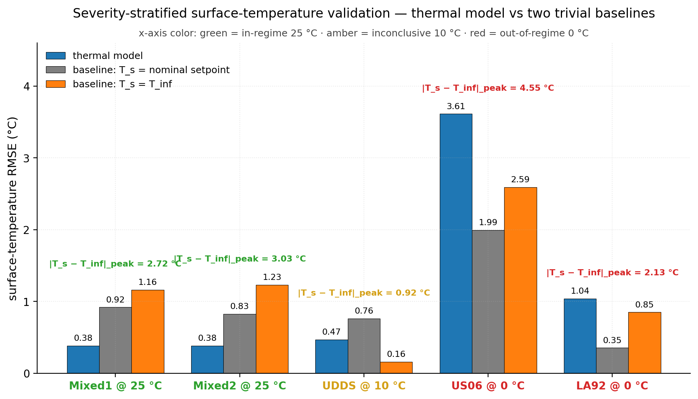
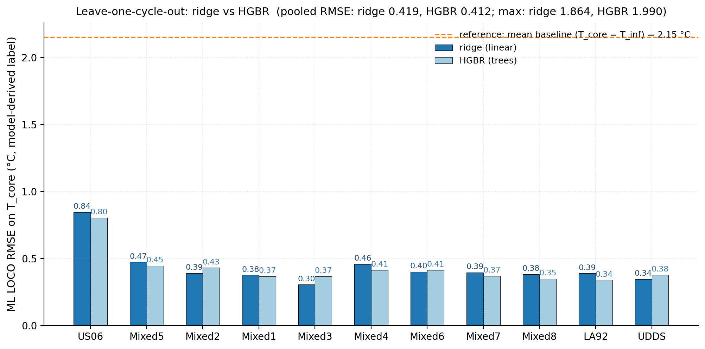
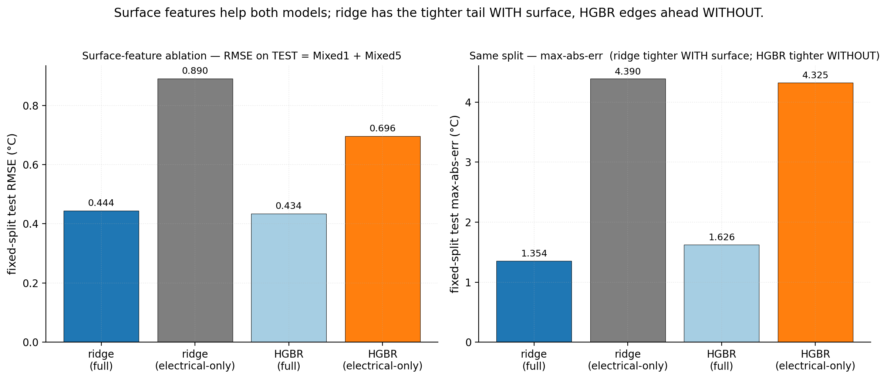

# Predicting a Lithium-Ion Cell's Hidden Core Temperature

**TL;DR.** This project estimates the internal *core* temperature of a lithium-ion cell — the quantity that governs battery safety — from the signals a real battery management system can actually measure: current, voltage, and surface temperature. No public dataset measures core temperature directly, so a calibrated two-state physics model generates the core-temperature labels and a machine-learning model learns to reproduce them. **Every core temperature in this report is model-derived, not measured.** Two findings define the work. First, the dominant uncertainty is physical, not algorithmic: the parameter that sets the core-surface temperature gap is unidentifiable from surface data, leaving a roughly 5 °C uncertainty band on the labels themselves — an order of magnitude larger than the ML's own prediction error. Second, a simple linear model matches gradient boosting to within 0.01 °C, because that unobservable physics, not model choice, is the ceiling. The through-line of the whole project is an honest accounting of where its uncertainty comes from.

## 1. The problem: predicting a temperature you can't measure

Lithium-ion cells fail from the inside out. The temperature that drives degradation, thermal runaway, and safety margin is the *core* temperature, deep in the jellyroll — but that is not what gets measured. A battery management system, and nearly every public dataset, sees only the *surface* temperature from a sensor on the casing. Under gentle use the two are nearly equal; under hard, high-current use the core can run several degrees hotter than the surface — and that gap opens up exactly when it matters most.

The analogy I keep returning to: it is like tracking a fever from a skin thermometer when what you care about is core body temperature. The skin reading is real and useful, but converting it to the core depends on how heat travels through the body, and you cannot read that from the outside.

The project's job is to bridge that gap — to estimate core temperature from signals a real system can measure. The approach is a physics-ML hybrid. A two-state thermal model (a hot core node and a cooler surface node, coupled by the cell's internal thermal resistance) is calibrated against measured surface temperature and then used to generate core-temperature labels. A machine-learning model learns to predict those labels from current, voltage, surface temperature, and their recent history — the surrogate a deployed system could actually run.

That design carries an unavoidable consequence, and it is the honest center of this writeup: **the "ground-truth" core temperatures are model-derived, never measured.** No core thermocouple exists in the data. That single fact shapes everything that follows — what can be validated, what cannot, and where the real uncertainty lives.

So this writeup is organized around two kinds of honesty, on the conviction that the most credible thing a project like this can do is name its own limits precisely. The first is *physical*: what the data fundamentally cannot tell us. The parameter controlling the core-surface gap turns out to be unidentifiable from surface measurements, so rather than disguise it as a confident single number, the project quantifies it as an uncertainty band (Section 3). The second is *methodological*: how the evaluation was kept from fooling us. Arriving at numbers worth trusting meant catching three separate ways the results looked right while being wrong (Section 4). Method comes first (Section 2), then results and both kinds of honesty, then the limitations the project does not try to paper over.

## 2. Method: physics first, then a learned surrogate

The pipeline has two stages. A calibrated physics model turns measurable signals into core-temperature labels; a machine-learning model then learns to reproduce those labels from the same measurable signals — so that a deployed system could skip the physics entirely and predict the core directly.

**The data.** I used the LG 18650HG2 dataset (McMaster University), real cells driven through standard automotive cycles — US06, LA92, UDDS, and eight mixed cycles — logged at 1 Hz. Everything in this writeup is the 25 °C set: eleven cycles where the cell was calibrated and tested in the same thermal regime. Colder ambients exist in the data and I deliberately set them aside; Section 4 shows why that boundary is real and not a convenience. The cell is never split row-by-row. Train and test are always *whole held-out cycles* — a row from the middle of a drive cycle is nearly identical to its neighbors, so a random split would test memorization, not generalization.

**Heat in.** The model's only energy input is the heat the cell generates, computed as current times overpotential: `Q = I·(V − V_OCV)`. That needs the cell's *resting voltage* at every charge level — the voltage it would settle to at rest — which I extracted from an 18-hour slow-discharge characterization (Figure 5). The gap between this resting curve and the voltage under load, times the current, is the power lost as heat.

*Figure 5. Open-circuit voltage V_OCV(SOC) for the LG HG2 cell, extracted from the C/20 characterization discharge at 25 °C. This lookup is used in the heat-generation term Q = I · (V − V_OCV) that drives the thermal model.*

**The two-state model.** The cell is represented as two connected thermal masses (Figure 1): a hot core where heat is generated, and a cooler surface that exchanges heat with the air. They are coupled by an internal thermal resistance, and the whole reason for two nodes instead of one is the quantity this project exists to estimate — the core-surface temperature gap, which at steady state is roughly `Q · R_cs`. Two coupled differential equations, integrated numerically, evolve the temperatures forward over each cycle.

*Figure 1. Two-state lumped thermal model used to generate the core-temperature labels. Core node (heat capacity C_core = 40.10 J/K, model-derived T_core) and surface node (C_surf = 3.10 J/K, measured T_surface) are coupled by R_cs = 3.39 K/W (R_cs band [1.70, 8.49] K/W carries the physical uncertainty); the surface dissipates to ambient (T_inf = 23.15 °C at 25 °C) via R_sa = 5.21 K/W. Q = I·(V − V_OCV) injects irreversible heat at the core node. Core temperature is model-derived throughout this report — never measured. LOCKED 2026-06-18b.*

**Calibration — pin what you can, fit only what you must.** The model has four physical parameters and only the surface temperature is measured, which makes a free four-parameter fit ill-posed: the optimizer can trade parameters off against each other to match the surface trace while producing nonsense underneath. So I constrained it instead. Total heat capacity is pinned from the cell's mass and specific heat. The surface-to-air resistance is fixed from cooling tails — stretches where the current is near zero and the surface decays exponentially toward its resting temperature. Only the remaining parameters are fit, against measured surface temperature on calibration cycles that never overlap the validation cycles. On an in-regime held-out cycle the modeled surface tracks the measurement to 0.38 °C RMSE (Figure 6) — though the figure also shows the model slightly *over*-predicting the surface peaks even here, a small bias that becomes the whole story at cold ambients in Section 4.

*Figure 6. Mixed1 @ 25 °C — modeled vs measured surface temperature using the locked 2026-06-18b central parameters (the same simulation that generated the core labels). Surface RMSE annotated. This is one of the two thermal-validation cycles whose pipeline-value claims are credible (see report-notes); modeled and measured track closely on in-regime data.*

**The labels are model-derived.** This bears repeating because it structures everything: the core-temperature labels the ML stage trains on come *out of this model*, not out of a sensor. There is no core thermocouple anywhere in the data. A good surface fit means the model reproduces what we *can* measure; it says nothing directly about whether the core values underneath are right.

**The learned surrogate.** With labels in hand, the ML stage learns to predict core temperature from current, voltage, surface temperature, and their recent history — lags, short rolling averages, and the surface's rate of change. I started with ridge regression (a regularized linear model) as the baseline and added gradient boosting (a flexible tree ensemble) as the more powerful alternative. Every model is scored by leave-one-cycle-out: trained on ten cycles, tested on the eleventh it never saw, repeated for all eleven.

## 3. The headline: the uncertainty that matters most is the one we can't measure

The single most important result in this project is not a performance number. It is that one parameter of the physics model — the internal resistance `R_cs` that sets the core-surface gap — cannot be pinned down from surface data, and that this, not anything about the machine learning, is where the real uncertainty lives.

The reason is structural. `R_cs` is the multiplier on the very gap we are trying to estimate: `T_core − T_surf ≈ Q · R_cs`. But the surface temperature is almost insensitive to it — you can change `R_cs` substantially and barely move the surface trace the calibration actually sees. So the parameter that most determines the answer is the one the data constrains least. This is not a shortcoming of effort or method; two independent papers reach the same conclusion, one by formal identifiability analysis and one empirically, that this exact parameter is the blind spot of surface-only thermal estimation.

The honest response is to refuse a false-precise single value. Instead I anchored `R_cs` to a physically plausible range from the cell's geometry — the radial conduction of an 18650 jellyroll across a span of literature thermal conductivities — and then propagated the *whole range* through the model. The result is Figure 2: the modeled core temperature is not a line but a band. Across the plausible `R_cs` range, the peak core temperature spreads by about 5 °C. That band is the dominant uncertainty in the entire pipeline.

*Figure 2. Model-derived core temperature on US06 @ 25 °C with the R_cs label-uncertainty band (R_cs ∈ [1.70, 8.49] K/W) shaded. Central line is the core trajectory at R_cs = 3.39 K/W (the geometric mid-band). The pipeline-wide R_cs uncertainty translates to a ~5 °C core-temperature spread; we show it here on US06 because that's where the band is widest (5.05 °C peak). It is the dominant physical uncertainty in the whole pipeline. Measured T_surface shown dashed for reference. US06 is the most aggressive 25 °C cycle and a thermal calibration cycle (see report-notes on US06 trustworthiness).*

Hold that number against the machine learning. The two ML models — a simple linear one and a flexible tree ensemble — disagree with each other by about 0.01 °C, and each predicts the labels to within roughly half a degree. The physical uncertainty in the labels themselves is an order of magnitude larger than either the ML's error or the gap between models. This is the through-line stated quantitatively: **the bottleneck was never the algorithm. It was always the part of the physics we cannot observe.** A low prediction error certifies that the surrogate faithfully reproduces the labels — not that the labels' absolute core values are correct. The credible thing a project like this can do is say exactly that, and measure the band rather than hide it.

## 4. Results

This is where the two honesty threads finally meet. I'll work in two layers, in the order the pipeline does: first, does the thermal model reproduce the one temperature I can actually check — the surface (§4a)? Then, given those labels, what does the ML stage learn, and what is it really limited by (§4b)?

But before any of that, the part I held back.

### The three mistakes I caught

Calibrating this model felt less like deriving an answer and more like sighting in a rifle. Your first group never lands on the bullseye — not because you aimed wrong, but because the scope isn't yet calibrated to where the barrel actually points. You read where the shots landed, adjust, fire again, and converge. Each of the three errors below was a miscalibration I only saw by looking at where the shots were landing.

**1. I was feeding the model the wrong ambient temperature.** I'd been using the chamber's nominal thermostat setpoint as the ambient reference. But the LG dataset reports the *setpoint*, not the measured chamber air temperature, and the two differ by a degree or more. The cell relaxes to the real chamber temperature — which I should have read off the asymptote of each cooling tail, not off the metadata. Using the setpoint baked a constant offset into every fit. The fix was to derive ambient (`T_inf`) from the cooling-tail asymptotes directly.

**2. A validation cycle had leaked into calibration.** To anchor the convective resistance I fit exponential decay to the rest periods — the cooling tails. One cycle, Mixed2, had its cooling tail sitting in *both* the calibration pool and the validation pool. The model had effectively seen part of its own test set, the textbook form of data leakage. The fix was to partition the tails by cycle before fitting anything.

**3. I was grading the model on cycles too easy to fail.** Some of the cycles I was validating on barely heated the cell — one or two degrees of excursion. A model can "pass" those without capturing any real dynamics, because "stay near ambient" is already almost the right answer. Reporting them flattered the model. I added an excursion gate so validation only runs on cycles with enough thermal swing to actually be a test.

None of these were exotic. They're the ordinary ways a time-series pipeline lies to you, and the only reason I caught them is that the numbers kept looking slightly *too* good. That's the tell I now trust most.

### 4a. Does the thermal model actually reproduce the surface? (Figure 3)

The surface temperature is the only thing in this whole pipeline I can validate against a real measurement, so this is the load-bearing check. Figure 3 stratifies five held-out cycles by thermal severity and compares the model's predicted surface temperature against two constant-temperature baselines: the **nominal setpoint** baseline (predict surface = the chamber's stated setpoint) and the stricter **`T_inf`** baseline (predict surface = the measured resting temperature). The second is the harder bar — beating it means the model's predicted temperature *rise* is doing real work, not just correcting a setpoint offset.

*Figure 3. Surface-temperature RMSE of the calibrated thermal model on five held-out validation cycles, compared to two trivial baselines: (i) predict T_surface = nominal chamber setpoint; (ii) predict T_surface = T_inf (data-driven cooling-tail asymptote). Cycle labels are color-coded by ambient regime: green = in-regime (25 °C, where the model was calibrated), amber = inconclusive (10 °C, mild excursion), red = out-of-regime (0 °C, cold-ambient extrapolation where the model breaks down). Peak excursion |T_s − T_inf| is annotated per group — it is the dynamic signal that was available to win. Note the cold-ambient (0 °C) failure: US06 @ 0 °C produces a model RMSE of 3.61 °C vs. baseline 1.99 °C. LOCKED 2026-06-18b.*

The result splits cleanly into three regimes:

| Ambient | Regime | Result vs. both baselines | Margin |
|---|---|---|---|
| 25 °C | In-regime | Beats both, including the strict `T_inf` dynamics test | +0.45 to +0.85 °C |
| 10 °C | Inconclusive | Excursion too small to separate model from baselines | — |
| 0 °C | Out-of-regime | Loses; over-predicts heat accumulation | up to ~6.7 °C gap |

(Figure 3 carries the per-cycle and per-baseline detail; the table summarizes by regime.)

This is the empirical justification for scoping the core-temperature labels to 25 °C only. The model earns its keep in the regime it was calibrated for and degrades honestly outside it; I'd rather state that boundary than quietly average over it.

### 4b. The ML stage (Figures 4 and 7)

The ML stage learns the surrogate map from electrical and surface signals to the model-derived core label. Figure 4 reports leave-one-cycle-out (LOCO) error across all 11 usable cycles for the ridge baseline and HistGradientBoosting.

| Model | Pooled LOCO RMSE (°C) | Max error (°C) |
|---|---|---|
| Ridge *(reported)* | 0.419 | 1.86 |
| HistGradientBoosting | 0.412 | 1.99 |
| Baseline: `T_core = T_inf` | 2.15 | — |

*Figure 4. Leave-one-cycle-out ML RMSE on model-derived T_core labels for the 11 LG 25 °C cycles: ridge vs HGBR. Bars are per-cycle held-out RMSE; cycles sorted by peak excursion (US06 first). Pooled values annotated in the title (ridge 0.419 vs HGBR 0.412 °C; max 1.86 vs 1.99 °C). Dashed reference line shows the mean per-cycle 'predict T_core = T_inf' baseline. The two ML models produce statistically indistinguishable held-out error — the surrogate map is effectively linear in this regime. Ridge has the better worst-case tail.*

The two models are a near-tie. A ~0.01 °C gap between a linear model and a gradient-boosted ensemble tells me the surrogate map is close to linear — which in turn means **the ML model is not the bottleneck.** There's no capacity left to buy. I report ridge as the single model: statistically indistinguishable RMSE, a slightly tighter worst-case tail with the full feature set, and the simplicity advantage of a linear model on a public project page.

Against the constant `T_core = T_inf` baseline, ridge is better by roughly 5×. So the pipeline *does* add value over assuming the core sits at ambient — but only on the cycles where that claim is clean (Mixed1 and Mixed2). I flag US06 explicitly: it was used to anchor `T_inf`, which makes any US06-based baseline comparison partly circular, and it's simultaneously the least-trustworthy label and the highest-stakes cycle. I don't lean on it.

And here is where the two threads close. The ML error is around 0.4 °C RMSE. The reproduced core values it's predicting carry the ~5 °C `R_cs` label band from §3 — an unobservable-parameter uncertainty roughly an order of magnitude larger than the model's own error. Sharpening the ML buys nothing against a 5 °C wall set by physics I can't measure from the outside. **The bottleneck was never model capacity. It was always the physics.**

**Ablation (Figure 7).** One footing note first: this experiment uses a fixed development split (test = Mixed1 + Mixed5), not the leave-one-cycle-out protocol behind Figure 4. That's deliberate — it keeps the full-feature and electrical-only rows on the same footing, so the degradation between them is a clean read. It's also why the full-feature numbers here differ slightly from the LOCO table above. When I deny the model its surface-temperature features and let it work from electrical signals alone, both models degrade sharply — surface temperature is carrying real signal, not just acting as a near-copy of the label. But the ranking flips:

| Feature set | Model | RMSE (°C) | Max error (°C) |
|---|---|---|---|
| Full (incl. surface) | Ridge | 0.444 | 1.35 |
| Full (incl. surface) | HGBR | 0.434 | 1.63 |
| Electrical only | Ridge | 0.890 | 4.39 |
| Electrical only | HGBR | 0.696 | 4.32 |

*Figure 7. Surface-feature ablation on the fixed dev split (TEST = Mixed1 + Mixed5). Left: RMSE; right: max-abs-error. Each panel: ridge full, ridge electrical-only (no surface features), HGBR full, HGBR electrical-only. With full features ridge has the better worst-case tail (max-abs: ridge 1.35 vs HGBR 1.63 °C). Strip the surface features and HGBR becomes better on BOTH RMSE (0.696 vs ridge's 0.890 °C) AND max-abs (4.32 vs ridge's 4.39 °C) — surface signals are doing the work that keeps ridge's tail tighter; without them the tree model edges ahead. This is exactly the regime a sensorless (electrical-only) deployment target would land in, and is therefore a documented reopener for the model choice (see decisions/model-selection.md "What would make us revisit"). LOCKED 2026-06-18b.*

With the full feature set ridge holds the tighter tail; strip the surface features and HGBR wins on both metrics. So my model choice is conditional: ridge is right for the sensored setup I built, but a genuinely sensorless deployment — core temperature from current and voltage alone — would reopen the choice in HGBR's favor. That's a clean direction for follow-up rather than a result I'll overclaim here.

**One finding without a figure.** I'd planned a residual plot for the cold-ambient regime, but the residual data wasn't retained and I won't re-run the locked pipeline to manufacture it. In prose, then: at 0 °C the model systematically *accumulates* heat the cell never shows, the same failure visible in Figure 3's out-of-regime result seen from the residual side. The heat-generation-versus-cooling balance that the calibration found at 25 °C simply doesn't transfer to cold, and the error compounds over the cycle rather than canceling.

## 5. Limitations: where the numbers are soft

The limitations of this project sit almost entirely on the physics-and-labels side of the pipeline — which is the same place the results kept pointing. I'll take the dominant one as already established and spend the space on the smaller biases a careful reader will still want named.

**The label band is the limitation, and it's already on the table.** Section 3 quantified it: `R_cs` is unidentifiable from surface data, so every core temperature in this report carries a ~5 °C band inherited from the *labels*, not the model. I won't re-derive it here, only restate its status. It is not one limitation among several — it is the limitation, and it sets the scale against which everything else in this section is small.

**The SOC axis is approximate in three declared ways.** `SOC = 1.0` is pinned to the characterization file's starting voltage (4.176 V) rather than true full charge (~4.20 V), so the top of every cycle reads `V_OCV` about 24 mV low, a bias that decays as the cell drains. SOC is normalized by the 3.0 Ah datasheet nominal, not the ~2.778 Ah measured at 25 °C, so my "100 %" is really ~93 % of usable capacity. And each cycle is assumed to start full — correct for the LG protocol, which fully charges before every test, but not a portable assumption. The same convention builds the OCV curve and runs the model, so these don't distort comparisons *between* cycles; they do mean the absolute heat term is a few percent soft, and the methods section should say so rather than imply the SOC axis is exact.

**The resting-voltage curve is discharge-only.** `V_OCV(SOC)` is built from the discharge half of the characterization sweep. Lithium-ion cells show a small charge/discharge hysteresis, so on regen segments — where current briefly pushes the cell toward higher charge — the heat term is slightly over-predicted. For this NMC chemistry the effect is small and one-directional; I name it rather than correct it, because averaging the charge and discharge halves is a refinement, not a fix for anything load-bearing.

**The clamp is a monitor, not a guarantee.** Cold cycles can pull the cell below the OCV table's lower bound; the simulator clamps SOC to the table range and counts the clamped samples per cycle, so any upward bias in `Q` from a floored `V_OCV` lands in the per-cycle record instead of hiding. That's a transparency mechanism — the cycles this writeup leans on don't trip it — but it's the reason cold-cycle heat terms can't be taken fully at face value.

**The trustworthy cycles are few, and the most important one is compromised.** As Section 4 showed, the clean pipeline-value claims rest on two cycles (Mixed1 and Mixed2), while US06 — the most aggressive cycle, and the one carrying the widest `R_cs` band — is also the cycle that anchors `T_inf`, which makes any US06-based baseline comparison partly circular. It is at once the highest-stakes and the least-trustworthy label, so I don't lean on it. The same honesty bounds the scope: the labels are 25 °C labels (Section 4a earns that line), and at 0 °C the model runs out of regime and over-accumulates heat (Section 4b). These aren't failures the project buries — they're edges it draws on purpose.

**What the limitations share.** Read the list back and the pattern is the one the results kept surfacing: every soft number here is about the heat term, the OCV axis, or the unobservable `R_cs` — the physics and the labels — and none of them is about the regressor. Model choice moved the answer by about a hundredth of a degree inside a five-degree band; the limitations live entirely on the other side of that ratio. The way to improve this project is not a better model.

### The validation gap: the core labels are model-derived, not measured

Everything above rests on one fact I want to state as plainly as I can: the core temperatures in this project are produced by the thermal model, not measured. The LG 18650HG2 dataset records surface temperature only — there is no internal thermocouple to check the labels against. So when the ML stage posts a low core-temperature error, that number says how faithfully it reproduced the thermal model's output, not how close it came to the cell's true core.

Closing that gap needs a dataset with a *measured* internal temperature under normal operation, and I went looking for one. The honest result is that, for a cell and duty cycle like mine, it isn't publicly available. The closest cell format is Purdue's direct-internal-temperature 18650 work ([Jones et al., 2023](https://doi.org/10.1038/s41598-023-41718-w)), but its data is shared only on request, the cells are LCO rather than my NMC chemistry, and the protocol is gentle constant-current cycling where the measured core-to-surface gap peaked near 0.5 °C — too small a gap, in the wrong regime, to test a 5 °C label band. Warwick/WMG's instrumented 21700 cells ([Gulsoy et al., 2022](https://doi.org/10.1016/j.est.2022.105260)) run closer to my scenario and show the internal temperature sitting consistently and notably above the surface, but I could find no released drive-cycle dataset from that line of work — only an abuse-to-failure thermal-runaway set, which is out of scope here. The internal-temperature datasets that *are* public are overwhelmingly thermal-runaway studies. And even genuine ground truth carries an asterisk: embedding a thermocouple in the jellyroll adds thermal resistance and can distort the very gradient it is meant to measure.

So the validation gap is real and, for now, cannot be closed with public data. That bounds what any accuracy figure here can claim — which I would rather say out loud than leave a careful reader to discover.

### How the field gets around this

The `R_cs` unidentifiability I hit is a known wall, not a quirk of my setup, and the literature takes two routes around it. The first is to measure the core directly with sensors built into the cell — thermocouples, RTDs, or fibre-optic Bragg-grating sensors — which is exactly the instrumented-cell work above, and exactly why a validation set for a project like this has to come from a lab equipped to do it. The second is sensorless: infer internal temperature from electrochemical impedance spectroscopy (EIS), which exploits the strong, repeatable temperature dependence of cell impedance at chosen frequencies; reviews report internal-temperature estimates within roughly 0.5–1 °C under favourable conditions ([Jinasena et al., 2022](https://doi.org/10.3389/fceng.2022.804704)). That route is genuinely appealing — no thermal model, no `R_cs` to identify — but it needs impedance measurements my dataset doesn't contain. Both paths land on the same point: with surface-temperature data alone, the core-to-surface resistance stays out of reach, so the honest move is to quantify the resulting band rather than model past it.

## 6. Reflection: what the project was really about

I came in to build a regressor and left having built an uncertainty estimate. The most important number in the project is a band, not a prediction — and the regressor, the part I'd expected to be the work, turned out to be nearly trivial once the labels existed.

The two honesty threads I set out with turned out to be one habit aimed in two directions. The physical thread — the `R_cs` band — is honesty about what the data can *identify*. The methodological thread — the three miscalibrations in Section 4 — is honesty about what the evaluation is actually *measuring*. Both are the same refusal: don't quote a number more confident than it has earned. And in both, the tell was identical. The moment a result looked slightly too good was the moment to distrust it — whether the flattery came from an unobservable parameter quietly setting the labels or from a leaked cycle quietly inflating the validation.

The lesson I'll carry forward is narrower and more useful than "physics-informed models are good." It's that *physics-informed* is a phrase that earns trust, and that trust is exactly the hazard. A model built on a biased physical parameter will produce confident, low-error predictions — of biased labels. The low error is real; it just certifies agreement with the labels, not with the cell. Nothing inside the machine learning could have told me that. What told me was the boring scaffolding around it: a naive baseline in every table, whole held-out cycles instead of rows, and the discipline of asking each metric what it actually certifies. The thing that protected this project wasn't the physics — it was the bookkeeping around the physics.

So the one-sentence version, the one I'd open a talk with: I built a careful estimator of a quantity I can't measure, and the most valuable thing it produces is an honest account of how much it can't know. The fever analogy from the start still holds. You can get very good at reading the skin — but past a point, the limit isn't your skill with the thermometer you have. It's the thermometer you don't.

## Code and data

The full pipeline, the locked `2026-06-18b` calibration, the figures, and the working notes behind this write-up are public at **[github.com/Avinashsingh17/li-ion-core-temperature-physics-ml](https://github.com/Avinashsingh17/li-ion-core-temperature-physics-ml)**. The repository's README walks through reproduction end to end, so I'll only flag the two things worth knowing before you clone.

**The raw data isn't mine to redistribute.** The drive cycles come from the LG 18650HG2 dataset (Kollmeyer et al., McMaster, on Mendeley Data); the repository carries the code and the model-derived artifacts but not the source data, which you download from Mendeley and place as the README describes.

**Reproduction has two honest modes.** The default path regenerates the published figures from the committed locked calibration — and the figure script refuses to run if that calibration drifts, so the numbers in this write-up can only ever come from the run that produced them. The second path re-derives the calibration from scratch, which is there for anyone who wants to check the physics rather than take it on trust; it may not land bit-for-bit on the locked parameters, and the same guard will say so. That split is the reproducibility version of the argument the whole write-up makes: be explicit about what's fixed, what's free, and how you'd know the difference.

## Part 2

Part 1 left one parameter unidentified. Part 2 audits all four.
[Part 2, Phase A: identifiability audit](part2_phase_a.md), which also
corrects the parameter confidence intervals reported in Section 5.
